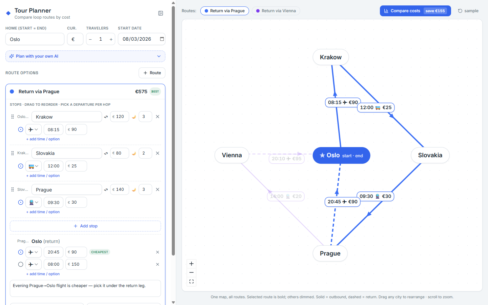
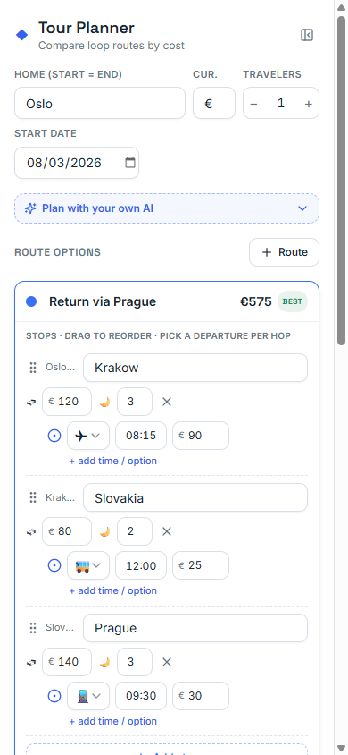

# Tour Planner

Plan and compare **multi-city loop trips** — start and end in the same city, visit places in
between, and see which route costs least. It's the [Traveling Salesperson
Problem](https://en.wikipedia.org/wiki/Travelling_salesman_problem), but you define the options
yourself instead of letting an algorithm pick.

Everything runs in the browser. No backend, no account — your plan auto-saves to `localStorage`.



<p align="center">
  
</p>

## What it does

- **One unified map** of every route (React Flow) — shared legs collapse to a single edge; routes
  fork only where they actually differ. Directed arrows show travel direction. Drag cities, pan,
  zoom.
- **Per-leg detail**: transport mode (✈ 🚆 🚌 🚗 ⛴), 24-hour departure time, fare, accommodation
  cost, and nights. Time is part of an edge's identity — the same leg at a different time (and
  fare) shows as a separate edge.
- **Cost comparison** on the right: savings banner, stacked transport/accommodation bars, and a
  full per-leg breakdown with the cheapest route highlighted.
- **Travelers** multiplier for group transport budgets.
- **Start date → itinerary dates**: nights per stop roll up into arrival dates and total trip
  length.
- **Per-route notes** for booking tips and links.
- **Drag to reorder** stops.
- **Plan with your own AI**: copy a prompt (schema + your draft) into any assistant, paste the
  JSON it returns to visualize and tweak — no AI runs on this site.
- **Share via link**: the whole plan encodes into the URL — send it to a travel buddy.

## Stack

React + TypeScript + Vite · Tailwind CSS + shadcn/ui (Radix) · React Flow (`@xyflow/react`).

## Develop

```bash
npm install
npm run dev      # http://localhost:5173
npm run build    # production build to dist/
npm run preview  # serve the build
```

## Deploy

Hosted on **Vercel**, connected to this repo — every push to `main` builds and deploys
automatically. Vercel auto-detects the Vite setup (`npm run build` → static `dist/`), so there's
no extra config to maintain. No environment variables or backend: the whole app is static.
